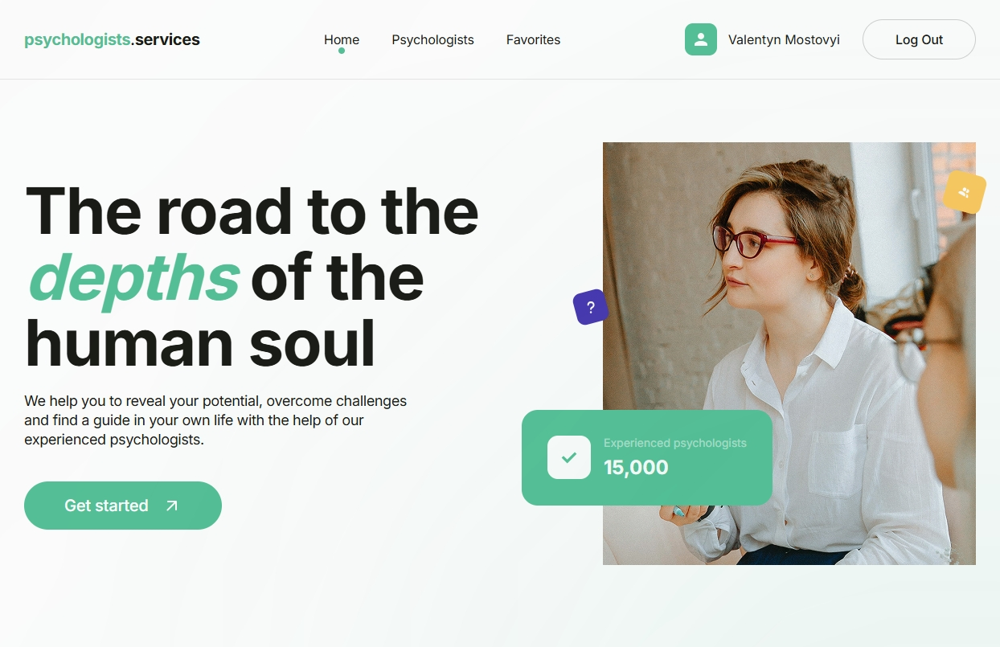

# Psychologists.Services



## Project Overview

**Psychologists.Services** is a responsive web application for browsing and saving psychologists to favorites.  
Users can sort specialists by name, price, or rating and manage a personal favorites list (available to authorized users only).  
The app is built with clean UI/UX, accessibility, and performance in mind.

## 🎨 Figma Design

[🔗 View Design on Figma](https://www.figma.com/design/I5vjNb0NsJOpQRnRpMloSY/Psychologists.Services?node-id=0-1&p=f)

## ✨ Features

### Public Access

- View all psychologists
- Sorting options:
  - A → Z / Z → A
  - Price: Low → High / High → Low
  - Rating: High → Low / Low → High

### Authenticated Users

- Add or remove psychologists from favorites
- Favorites page with persistent state (localStorage / Firebase-ready)
- Protected private routes
- Toast notifications (success / error)
- Session persistence on reload

### Additional

- Registration + display name
- Custom modal & animations
- Mobile-first and fully responsive

## 🛠 Tech Stack

- **React** + **TypeScript**
- **Redux Toolkit** + **Thunk**
- **React Router v6**
- **Formik** + **Yup**
- **Firebase Auth** + **Realtime Database**
- **Axios** for HTTP requests
- **Framer Motion** for animation
- **MUI** with style overrides
- **Notistack** for toast messages
- **SCSS Modules**
- **Responsive Design**

## 📁 Project Structure

```

├── components/        # Reusable UI components
├── pages/             # Route-level views (Home, Psychologists, Favorites)
├── store/             # Redux slices, async thunks, selectors
├── firebase/          # Firebase configuration
├── constants/         # Shared constants like PAGE\_SIZE
├── styles/            # Global and utility SCSS

```

## ✅ Status

- ✔️ Fully implemented
- ✔️ Meets all technical requirements
- ✔️ Responsive and mobile-friendly

```
> Created by [Valentyn M.](https://github.com/Valentyn-M)
```
